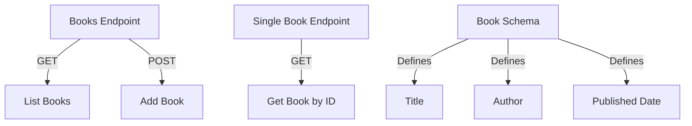

### Documenting a RESTful API Using OpenAPI Specifications

#### Overview
OpenAPI Specification (OAS) provides a standard format for documenting RESTful APIs. It allows for machine-readable interface files that describe, produce, consume, and visualize web services. Documentation can be created in JSON or YAML format.

#### Tools
- **Swagger Editor**: An online tool for writing and editing OpenAPI specifications. It allows you to visualize the documentation in real time.
- **Swagger UI**: Generates interactive API documentation from your OpenAPI specs.
- **Mermaid**: A JavaScript library for generating diagrams and flowcharts from text, useful for illustrating API relationships.

#### Resources
1. **OpenAPI Specification Documentation**: [OpenAPI Specification](https://swagger.io/specification/)
2. **Swagger Editor**: [Swagger Editor](https://editor.swagger.io/)
3. **Swagger UI**: [Swagger UI](https://swagger.io/tools/swagger-ui/)
4. **Mermaid Documentation**: [Mermaid Live Editor](https://mermaid-js.github.io/mermaid-live-editor/)
5. **Postman**: [Postman](https://www.postman.com/) (for API testing and documentation)

#### Example OpenAPI Specification

Here's a simple example in YAML format that documents a fictional API for managing a library:

```yaml
openapi: 3.0.0
info:
  title: Library API
  version: 1.0.0
  description: API for managing library books and authors.
servers:
  - url: http://api.library.com/v1
paths:
  /books:
    get:
      summary: List all books
      responses:
        '200':
          description: A list of books
          content:
            application/json:
              schema:
                type: array
                items:
                  $ref: '#/components/schemas/Book'
    post:
      summary: Add a new book
      requestBody:
        required: true
        content:
          application/json:
            schema:
              $ref: '#/components/schemas/Book'
      responses:
        '201':
          description: Book created
  /books/{bookId}:
    get:
      summary: Get a book by ID
      parameters:
        - name: bookId
          in: path
          required: true
          description: ID of the book to retrieve
          schema:
            type: string
      responses:
        '200':
          description: Book details
          content:
            application/json:
              schema:
                $ref: '#/components/schemas/Book'
        '404':
          description: Book not found

components:
  schemas:
    Book:
      type: object
      properties:
        id:
          type: string
        title:
          type: string
        author:
          type: string
        publishedDate:
          type: string
          format: date
```

#### Using Mermaid for Diagrams

To illustrate relationships, you can use Mermaid syntax. Below is an example of how to visualize the interaction between the API endpoints:



#### Tips for Effective Documentation

1. **Use Descriptive Titles and Summaries**: Ensure that your endpoint titles and summaries are clear and informative.
2. **Define Error Responses**: Document potential error responses for better client handling.
3. **Versioning**: Include versioning in your API to manage changes over time effectively.
4. **Examples**: Provide example requests and responses to help developers understand how to interact with your API.

____________


